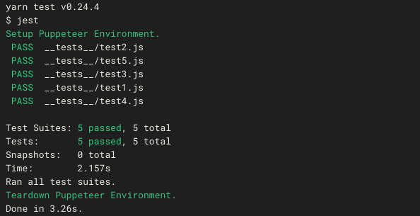

# jest-puppeteer-example

This is an example of using the global setup/teardown apis alone with the async test-environment apis to make jest work smoothly with puppeteer.

> Please file an issue or send [me](https://twitter.com/xfumihiro) a DM if you have any questions.
